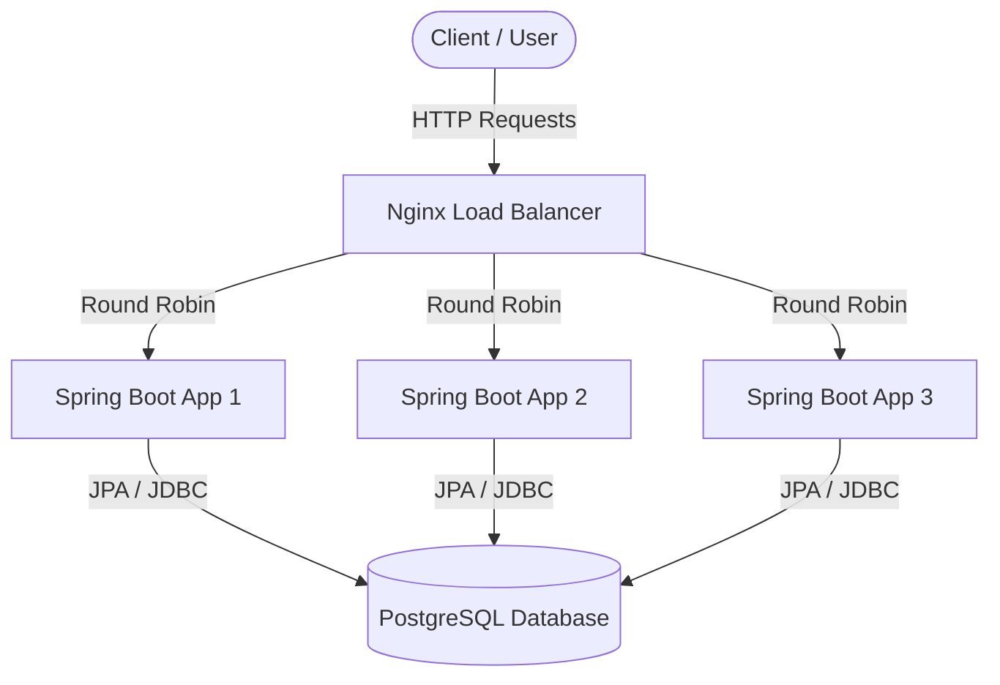

# Remitly Stock Market Task

   

Stock market service built with Spring Boot 3.2.5, Java 21, and PostgreSQL. It is designed to run in multiple instances load-balanced by Nginx and uses pessimistic locking to prevent race conditions during concurrent buy/sell operations.

## Architecture

- **Stateless Application**: The Spring Boot application instances hold no internal state. All state is maintained in the PostgreSQL database.
- **Load Balancer**: Nginx sits in front of the application instances, round-robining incoming traffic to distribute the load across the 3 backend replicas.
- **Database**: A single PostgreSQL instance provides the persistent storage layer.
- **Concurrency Control**: Spring Data JPA with Hibernate is used. Specifically, pessimistic locking (`PESSIMISTIC_WRITE`) is employed at the database level when reading bank and wallet stocks during buy/sell operations to ensure atomicity.

### System Architecture Diagram



### Project Structure
```text
stock-exchange/
├── src/
│   ├── main/java/com/example/stockexchange/
│   │   ├── controller/      # REST API Endpoints
│   │   ├── dto/             # Data Transfer Objects
│   │   ├── entity/          # JPA Entities (BankStock, Wallet, WalletStock, AuditLog)
│   │   ├── exception/       # Domain Exceptions & GlobalExceptionHandler
│   │   ├── repository/      # Spring Data JPA Repositories (with @Lock)
│   │   └── service/         # Transactional Business Logic
│   └── test/java/...        # Integration & Concurrency Tests
├── Dockerfile               # Multi-stage Java 21 build
├── docker-compose.yml       # Orchestration (1x DB, 3x App, 1x Nginx)
├── nginx.conf               # Nginx reverse proxy configuration
├── pom.xml                  # Maven project descriptor
├── start.bat / start.sh     # Bootstrapping scripts
└── test-ha.bat              # Chaos engineering & failover test script
```

## Prerequisites
- Docker
- Docker Compose

## How to Run

1. Clone the repository and navigate to the project directory:
   ```bash
   git clone https://github.com/sebbmon/stock-market.git
   cd stock-market
   ```
2. Make sure your chosen port is free.
3. Run the provided start script with your desired port:

### On Linux/macOS
```bash
chmod +x start.sh
./start.sh <PORT>
# Example: ./start.sh 8080
```

### On Windows
```bash
start.bat <PORT>
# Example: start.bat 8080
```

The service will be available at `http://localhost:8080` (or whichever port you provided).

## Endpoints

1. **Buy/Sell Stock**
   `POST /wallets/{wallet_id}/stocks/{stock_name}`
   Body: `{"type": "sell"}` or `{"type": "buy"}`
   - `200 OK` on success.
   - `400 Bad Request` if Bank has 0 stock (on buy), Wallet has 0 stock (on sell), or invalid type.
   - `404 Not Found` if the stock doesn't exist in the Bank.
2. **Get Wallet**
   `GET /wallets/{wallet_id}`
   - `200 OK` on success.
   - `404 Not Found` if the wallet doesn't exist.
3. **Get specific Stock in Wallet**
   `GET /wallets/{wallet_id}/stocks/{stock_name}`
   - `200 OK` on success.
   - `404 Not Found` if the wallet or stock doesn't exist.
4. **Get Bank State**
   `GET /stocks`
   - `200 OK` on success.
5. **Set Bank State**
   `POST /stocks`
   Body: `{"stocks": [{"name":"stock1", "quantity":99}]}`
   - `200 OK` on success.
6. **Get Audit Log**
   `GET /log`
   - `200 OK` on success.
7. **Trigger Chaos (Kill Instance)**
   `POST /chaos`
   Kills the instance serving the request to test high availability. Nginx will automatically route subsequent requests to surviving instances. Docker Compose will automatically spin up the killed instance back again thanks to the `restart: always` policy.

## Testing High Availability (Chaos)

You can easily verify the cluster's high availability by using the provided `test-ha.bat` script:

```cmd
test-ha.bat
```
This script calls the `/chaos` endpoint to shut down one of the replicas and immediately sends a follow-up request to demonstrate that the system is still fully operational.

## Integration and Concurrency Tests

The application includes comprehensive integration tests written in Java (`StockMarketIntegrationTest.java`) that verify the correctness of the business logic and the pessimistic locking mechanism.

- **`shouldSuccessfullyBuyAndSellStock`**: Verifies the standard happy path where a user creates a wallet and buys, then sells a stock. It ensures that balances are correctly updated and the transaction is logged.
- **`shouldReturn404WhenStockNotFound`**: Ensures the API returns `404 Not Found` when attempting to buy an unknown stock.
- **`shouldReturn400WhenSellingWithoutStock`**: Ensures the API returns `400 Bad Request` when attempting to sell a stock that the user doesn't own.
- **`testConcurrentBuysWithPessimisticLocking`**: A rigorous concurrency test that uses an `ExecutorService` to fire 40 simultaneous buy requests for the exact same stock. It guarantees that the `@Lock(LockModeType.PESSIMISTIC_WRITE)` mechanism works perfectly, preventing race conditions and ensuring exactly 40 stocks are sold without any negative balances or deadlocks.

> [!IMPORTANT]
> To run these Java integration tests locally from your IDE or Maven, you must expose the PostgreSQL port in your `docker-compose.yml` (add `ports: - "5432:5432"` to the `db` service definition). The tests require a running database instance to connect to.

---

## Architecture Decision Record (ADR)

### ADR 1: Nginx for High Availability
**Context:** We need to handle high loads and provide fault tolerance. If one Spring Boot instance crashes, the system must continue to operate.
**Decision:** We deployed 3 replicas of the stateless Spring Boot application behind an Nginx reverse proxy using Docker Compose. 
**Consequences:** Nginx abstracts the replicas from the client. When a replica is killed (`/chaos`), Nginx seamlessly routes requests to the remaining healthy replicas. The application must remain strictly stateless.

### ADR 2: Pessimistic Locking for Concurrency Control
**Context:** The system must accurately reflect stock quantities in both the bank and user wallets without negative balances, especially under concurrent loads (e.g., thousands of simultaneous buy/sell requests).
**Decision:** We implemented `@Lock(LockModeType.PESSIMISTIC_WRITE)` on the `BankStockRepository` and `WalletStockRepository`.
**Consequences:** 
- The database acquires an exclusive row-level lock (e.g., `SELECT FOR UPDATE` in PostgreSQL) when a transaction reads the stock data.
- This entirely prevents race conditions. A second concurrent transaction attempting to buy the same stock will block until the first completes, ensuring the quantities are updated safely.
- While this reduces maximum throughput compared to optimistic locking, it eliminates the need for retry logic on `OptimisticLockException` and perfectly guarantees consistency in high-contention scenarios. We lock the `BankStock` first, then the `WalletStock`, to avoid deadlocks.
